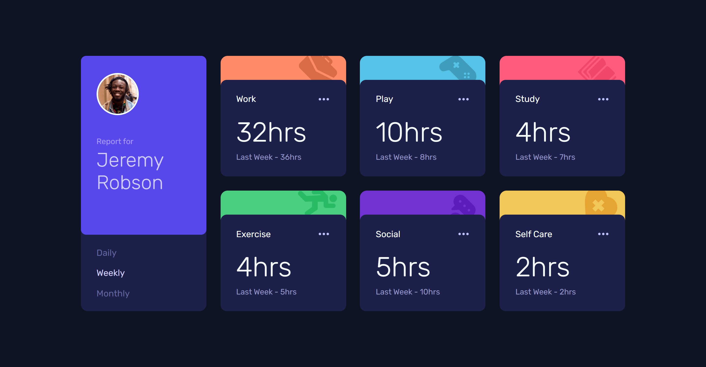
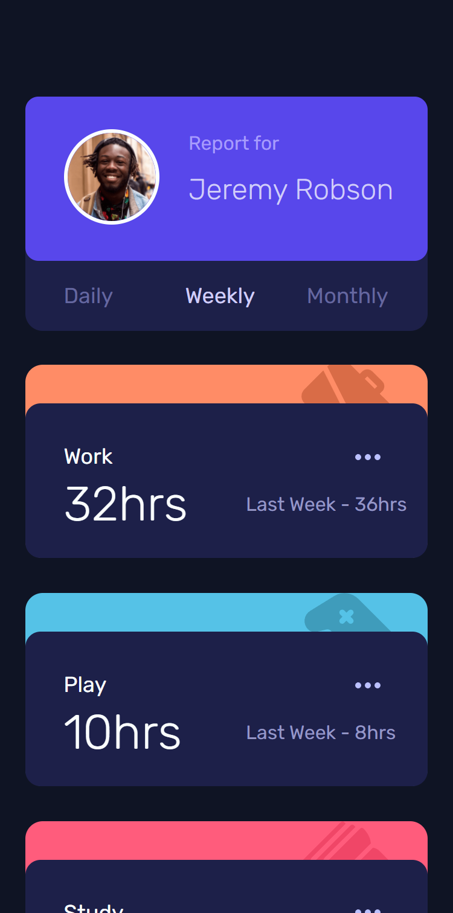

# Frontend Mentor - Time tracking dashboard solution

This is a solution to the [Time tracking dashboard challenge on Frontend Mentor](https://www.frontendmentor.io/challenges/time-tracking-dashboard-UIQ7167Jw). Frontend Mentor challenges help you improve your coding skills by building realistic projects. 

## Table of contents

- [Frontend Mentor - Time tracking dashboard solution](#frontend-mentor---time-tracking-dashboard-solution)
  - [Table of contents](#table-of-contents)
  - [Overview](#overview)
    - [The challenge](#the-challenge)
    - [Screenshot](#screenshot)
    - [Links](#links)
  - [My process](#my-process)
    - [Built with](#built-with)
    - [What I learned](#what-i-learned)
    - [Useful resources](#useful-resources)
  - [Author](#author)
## Overview

### The challenge

Users should be able to:

- View the optimal layout for the site depending on their device's screen size
- See hover states for all interactive elements on the page
- Switch between viewing Daily, Weekly, and Monthly stats

### Screenshot

### Links

- Live Site URL: [Preview](https://github.com/K0smic/nft-preview-card-component)

## My process

### Built with

- Semantic HTML5 markup
- CSS custom properties
- Flexbox
- CSS Grid
- [Sass](https://sass-lang.com/)

### What I learned
This project took longer than expected, there are many variables to take into account such as the revision of the grid documentation, the non-use of Bootstrap, the Javascript code and the measures to be as faithful as possible to the design.

All in all I am very satisfied with the result, I would like to seek as many tips as possible to make the code more optimized and more readable.

### Useful resources

- [Font-size Clamp Generator](https://clamp.font-size.app/) - Perfect for resizing any size, from fonts to images.
- A ruler - I measured the distances and everything with a ruler, I used the responsive mode of chrome both on my project and on the images.
  
## Author

- Github - [K0smic](https://github.com/K0smic)
- Frontend Mentor - [@K0smic](https://www.frontendmentor.io/profile/K0smic)